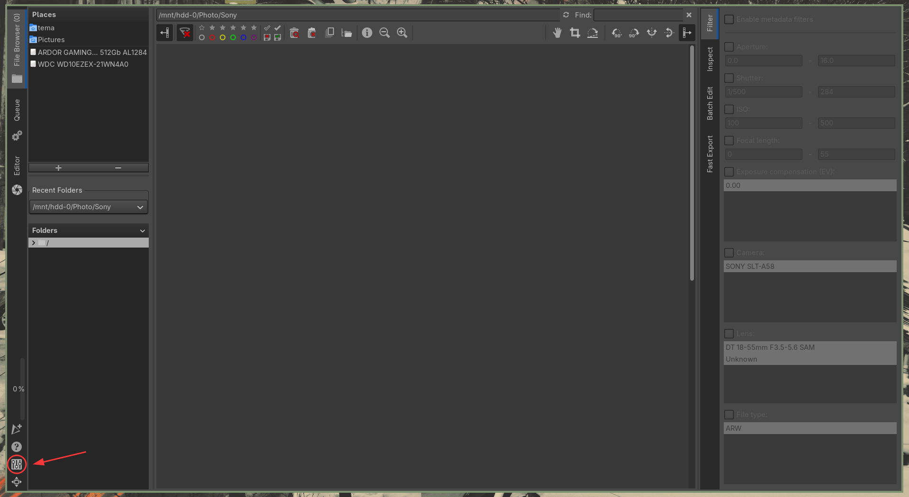
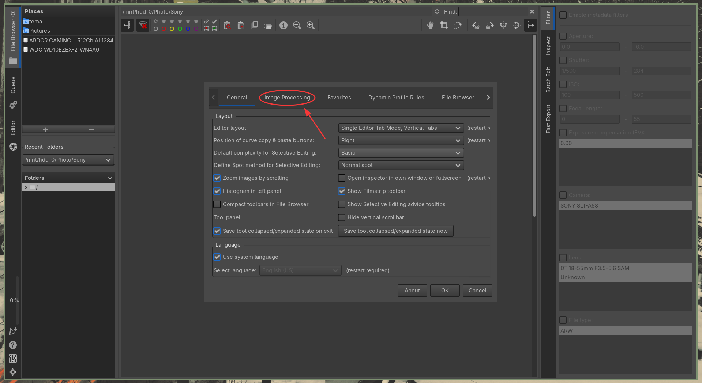
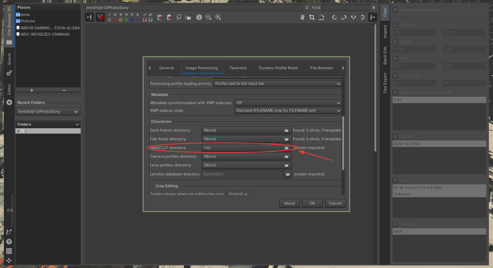

# Clut color themes for [ART](https://artraweditor.github.io/) & [RawTherappe](https://github.com/RawTherapee/RawTherapee)
Все cluts были взяти из [gowall](https://github.com/Achno/gowall) и размешены мной ради удобства использования их в [ART](https://artraweditor.github.io/) & [RawTherapee](https://github.com/RawTherapee/RawTherapee
)
## Color themes
*    `Gruvbox`
*    `Catppuccin`
*    `Everforest`
*    `Solarized`
*    `Tokyo-dark` 

## До/После
### До

### После

## Примеры фото
### [Gruvbox](https://github.com/morhetz/gruvbox)

### [Everforest](https://github.com/sainnhe/everforest)

### [Catppuccin](https://github.com/catppuccin/catppuccin)

### Tokyo-dark

### [Solarized](https://github.com/altercation/solarized)
 

## Инструкция по установке в ART & RawTherappe

